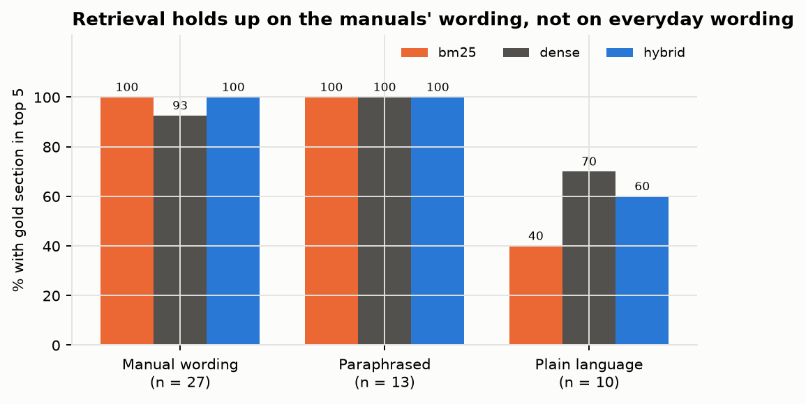
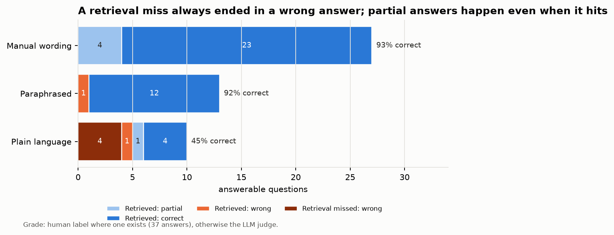
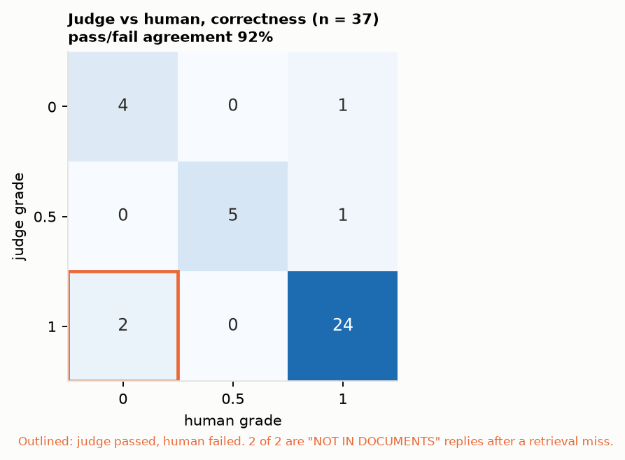
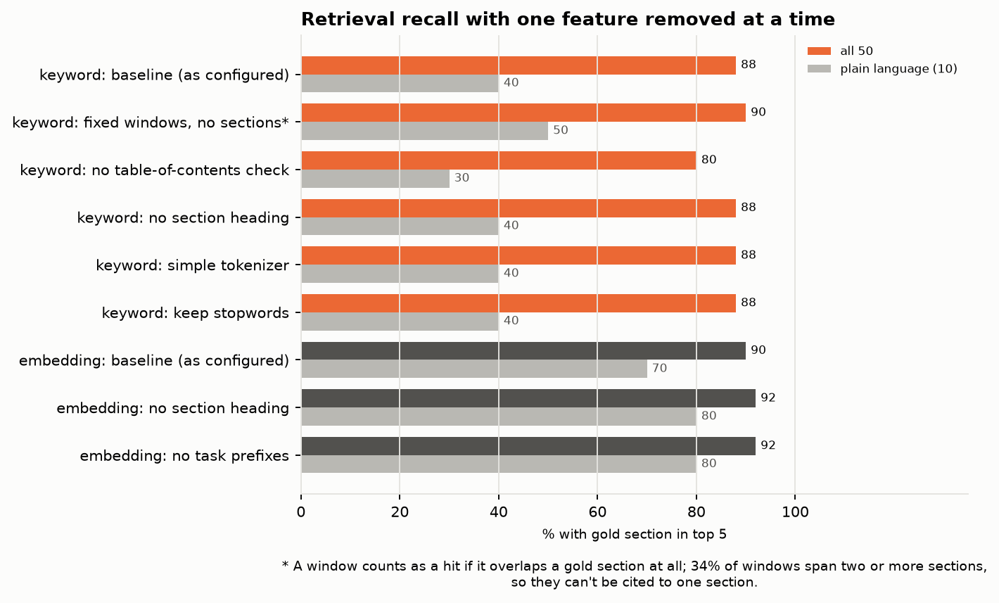
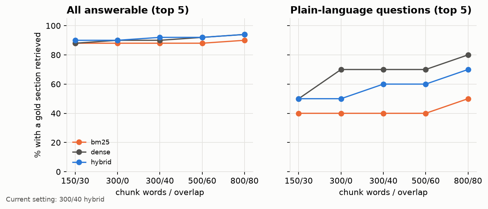
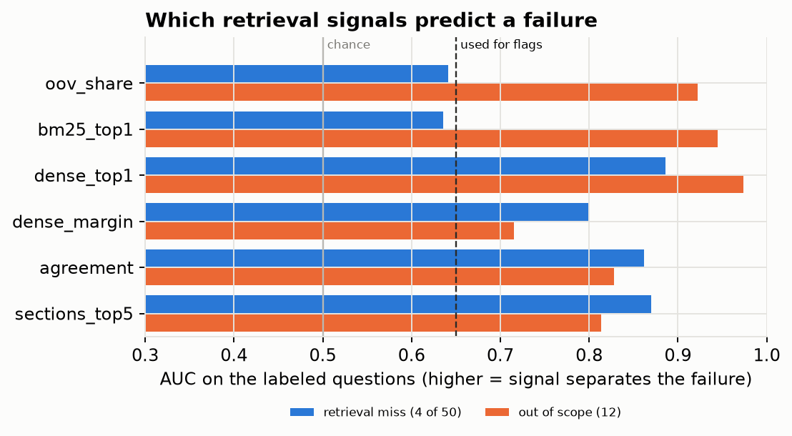
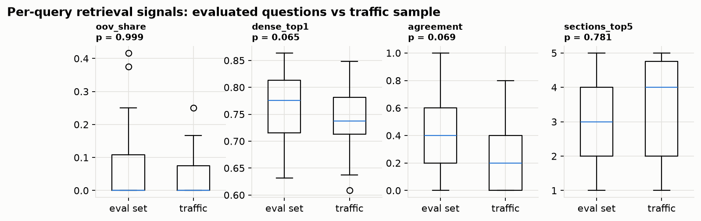

# Policy RAG: cited answers from CMS billing-policy manuals, with a measured evaluation

A reviewer working a payment-integrity flag ("units per patient-day above the MUE", "timed therapy units averaging
under 15 minutes") needs the policy that applies, with a citation they can check. This project answers billing-policy
questions from four CMS manuals using **local models (Ollama)**, cites the manual section for every claim, says
**"NOT IN DOCUMENTS"** when the manuals don't cover a question, and **measures** all of that rather than eyeballing
a few answers.

It complements the [Medicare FWA outlier project](https://github.com/RonCom/medicare-fwa): that project flags
providers whose billing is unusual; this one retrieves the rules a reviewer would check those flags against.

## Corpus

| Document | Why it is here | Link |
|---|---|---|
| NCCI Policy Manual, Ch. 1 (2026): general correct coding | Unbundling, modifiers 25/59/X{EPSU}, MUEs, add-on codes | [PDF](https://www.cms.gov/files/document/01-chapter1-ncci-medicare-policy-manual-2026-final.pdf) |
| NCCI Policy Manual, Ch. 11 (2026): medicine and E&M | Physical medicine and rehabilitation, chiropractic, E&M edits | [PDF](https://www.cms.gov/files/document/11-chapter11a-ncci-medicare-policy-manual-2026-final.pdf) |
| Medicare Benefit Policy Manual, Ch. 15 | Coverage of therapy (§220–230): plans of care, certification, documentation | [PDF](https://www.cms.gov/regulations-and-guidance/guidance/manuals/downloads/bp102c15.pdf) |
| Medicare Claims Processing Manual, Ch. 5 | Outpatient rehab billing: timed units and the 8-minute rule (§20.2), KX modifier, MPPR | [PDF](https://www.cms.gov/regulations-and-guidance/guidance/manuals/downloads/clm104c05.pdf) |

Save the four PDFs to `data/docs/` (git-ignored).

## How it works

1. **Section-aware chunking** (`ingest.py`). The manuals have their own structure: NCCI uses lettered sections
   ("V. Medically Unlikely Edits"), the CMS manuals numbered ones ("§20.2 Reporting of Service Units"). Chunks follow
   that structure (about 300 words, 40-word overlap), so every answer can cite a section a reviewer can look up.
   Running headers, page labels, tables of contents and revision history are removed. A line counts as a
   section heading only if it is one of the next few entries in the manual's table of contents; this stops
   cross-references such as "see 220.2 - Reasonable and Necessary ...)" from splitting a section. The result is
   851 chunks across 304 sections.
2. **Three retrievers** (`retrieve.py`): BM25 (exact tokens such as CPT codes, "modifier 59", "8 minutes"), dense
   embeddings (`nomic-embed-text` via Ollama, for paraphrased questions), and hybrid (reciprocal rank fusion).
   Vectors live in DuckDB.
3. **Grounded answers** (`answer.py`): a local model answers only from the numbered excerpts, cites each claim
   `[n]`, and replies `NOT IN DOCUMENTS` when the excerpts don't cover the question.
4. **Evaluation** (`evaluate.py`), on 62 questions in `eval/questions.jsonl`: 50 answerable, each with a reference
   answer, key facts and gold manual sections, and 12 that the corpus does not answer (Part D penalties, MS-DRG
   weights, MIPS thresholds…). For each question it records:
   - **retrieval:** recall@k and MRR for each retriever, with paired bootstrap intervals;
   - **abstention:** declines on unanswerable questions, and false declines on answerable ones;
   - **citations:** whether the answer cites a gold section (deterministic, no model involved);
   - **LLM-as-a-judge:** correctness against the key facts, and faithfulness to the excerpts, scored by a larger
     local model than the one answering;
   - **closed-book baseline:** the same model with no excerpts, to show what retrieval adds and how often the
     model invents an answer.

   Runs are logged to MLflow, and each answer is an MLflow trace (see [MLOps](#mlops-mlflow-and-evidently)).
5. **Judge calibration** (`policy-rag calibrate`): an LLM judge is only useful if it agrees with a person. `eval`
   writes `eval/human_labels.csv`; label a sample yourself (`human_correct` 0/0.5/1, `human_faithful` 0/1) and
   `calibrate` reports agreement and Cohen's kappa.
6. **Retrieval sweep** (`sweep.py`): chunk size x overlap x retriever, as nested MLflow runs, with a selection rule
   stated before the run.
7. **Feature ablation** (`ablation.py`): removes one retrieval feature at a time to measure what each is worth.
8. **Monitoring** (`monitor.py`): Evidently drift reports on label-free retrieval signals, comparing incoming
   questions with the evaluated ones, plus a review queue of low-confidence queries.

The questions were drafted from the manual text (with Claude) and checked against the source sections; each
unanswerable topic was confirmed absent from the corpus by searching the chunk text.

## Run it

Requires [uv](https://docs.astral.sh/uv/) and [Ollama](https://ollama.com).

```bash
ollama pull nomic-embed-text
ollama pull gemma4:e4b            # answers (fits 8 GB of VRAM)
# judge: gemma4:26b (config.yaml); any larger local model works

uv sync
uv run policy-rag index           # parse, chunk, embed -> data/index.duckdb
uv run policy-rag ask "How many units can be billed for 40 minutes of 97110 and 97140?"
uv run policy-rag eval --no-judge # answers + retrieval, abstention, citations (no judge model)
uv run policy-rag eval --judge-only  # grade those saved answers with the judge model (slow on 8 GB VRAM)
uv run policy-rag calibrate       # after labeling eval/human_labels.csv
uv run policy-rag sweep           # chunking x retriever grid (one embedding pass per chunk size)
uv run policy-rag ablate          # remove one retrieval feature at a time (--bm25-only: no Ollama)
uv run policy-rag monitor         # drift: eval questions vs eval/traffic_sample.jsonl (add --answers to run the model)
uv run pytest -q
uv run mlflow ui --backend-store-uri sqlite:///mlflow.db
```

`--fake` runs any command without Ollama (hash embeddings, canned replies), for tests and dry runs.

## Results

Models: `nomic-embed-text` (embeddings), `gemma4:e4b` (answers), `gemma4:26b` (judge), all local through Ollama.
62 questions: 50 answerable (27 phrased like the manuals, 13 paraphrased, 10 in plain reviewer language) and 12 the
manuals do not answer. Retrieval returns the top 5 excerpts.

**Retrieval** (50 answerable questions; a hit = a chunk from a gold section in the top k)

| Retriever | Top 1 | Top 5 | MRR | Top 5, manual wording (40) | Top 5, plain language (10) |
|---|---|---|---|---|---|
| BM25 | 76% | 88% | 0.81 | 100% | 40% |
| Dense (`nomic-embed-text`) | 70% | 90% | 0.79 | 95% | **70%** |
| **Hybrid (RRF)** | **76%** | **92%** | **0.83** | 100% | 60% |

Questions written in the manuals' own words are easy for keyword search; plain-language questions are where it
breaks (40%) and embeddings earn their place (70%). Hybrid keeps BM25's precision on exact terms and most of the
dense gain: +4 points over BM25 at top 5 (95% CI 0 to +10) on 50 questions, so the ranking among methods is
suggestive rather than settled. Ten plain-language questions is the main gap in the test set.



*What it shows:* every retriever finds the gold section for all 13 paraphrased questions and nearly all 27 in the
manuals' wording. The drop is entirely on plain-language questions: BM25 4 of 10, hybrid 6, dense 7.

*What it decides:* hybrid stays the default. It matches BM25 on exact tokens and recovers most of the
plain-language gap; dense leads there by one question out of ten, which is not evidence. Going forward,
everyday wording is the failure mode to watch, so it is what monitoring tracks, and it is where the test set
needs more questions before dense and hybrid can be told apart.

**Answers** (hybrid retrieval)

| | With retrieval | Same model, no documents |
|---|---|---|
| Judged correct, answerable questions | **84%** | 50% |
| Declined the 12 questions the manuals do not answer | **12 / 12** | 9 / 12 (answered 3 from memory, unsourced) |
| Declined an answerable question | 3 / 50 | – |
| Cited a gold section when answering | 89% | – |
| Judged faithful to the excerpts | 100% | – |

Retrieval is what makes the model usable: it raises correctness from 50% to 84%, and every claim it makes is tied to
a cited section. Without the documents, the model answered 3 out-of-scope questions from general knowledge, with
nothing a reviewer could check.


*What it shows:* 11 of the 50 answerable questions fall short of fully correct (grades are my label where I
labeled the answer, the judge's otherwise). Four are retrieval misses, all on plain-language questions, and all
four answers were wrong: two answered confidently from the wrong section (e.g. "does Medicare stop paying once the
patient stops improving?" retrieved a notification section instead of §220.2's maintenance rule, and the model
said "yes"), two declined. The other seven had the right section in hand: five partial answers that left out a
secondary fact (such as the 14-day rule for verbal certifications), one false decline and one misreading.
Plain-language questions score 45%; the other 40 score 92-93%.

*What it decides:* a retrieval miss turned into a wrong answer 4 times out of 4, so retrieval is the first thing
to tune (the sweep below). More points are lost with the right section retrieved, though, so the next lever is the
answer step. One hypothesis to test: the prompt limits answers to 1-4 sentences, which may be what drops secondary
facts. Testing it needs the judge on every answer, so it is an eval run compared on `answer_prompt_sha` in MLflow,
not part of the retrieval sweep.


*What it shows* (judge grades on both sides): retrieval lifts manual-wording questions from 63% to 93% and
paraphrased ones from 15% to 92%, and keeps all 12 out-of-scope questions declined (the model alone answered 3
without a source). On plain-language questions the gain disappears: 50% with the manuals, 60% without. That is one
question apart on ten, but the direction matters. When retrieval misses, the system answers from the wrong section
*with a citation*, which looks more trustworthy than an unsourced guess.

*What it decides:* retrieval stays; it carries 40 of 50 answerable questions and the scope control. For everyday
questions, retrieval has to improve before the answers can be trusted. A candidate guard for later, to be tested
on the eval set first: when the monitoring signals say retrieval is unsure, decline or flag instead of answering.

**Judge calibration** (37 answers labeled by hand, chosen to include errors, partial answers and declines)

| | Agreement with human | Cohen's kappa | Judge pass rate | Human pass rate |
|---|---|---|---|---|
| Correctness | 92% (34 / 37) | **0.68** | 86% | 84% |
| Faithfulness | 97% (36 / 37) | not informative* | 97% | 100% |

\* Every labeled answer was faithful by the human rubric, so kappa has no variance to measure; agreement is the
useful number. The correctness judge is trustworthy enough to report (kappa above 0.6), with one systematic
leniency worth knowing: it accepted two "NOT IN DOCUMENTS" replies because the retrieved excerpts lacked the answer,
although the manuals contain it. The judge grades against what was retrieved, so retrieval misses can look like
correct declines; the deterministic "retrieved a gold section" check catches those cases.



*What it shows:* 34 of 37 agree on pass/fail. Two of the three disagreements go the same way: the judge passed
"NOT IN DOCUMENTS" replies that followed a retrieval miss. The third goes the other way (judge 0, human 1).

*What it decides:* the judge grades correctness at scale, and every decline is cross-checked against the
deterministic gold-section check; both scores sit on the same MLflow trace for that reason. The calibration
belongs to one judge model and one judge prompt, so a change to either (`judge_prompt_sha` in MLflow) means
labeling a fresh sample before trusting the judge's numbers again.

## Feature engineering: what, why, and impact

In a RAG system the features are how documents and queries are represented for search, plus the signals used to
watch it in use. Each choice below was made for a stated reason. `policy-rag ablate` then removes one at a time
and re-scores retrieval on the same 50 answerable questions, so the "impact" column is measured rather than
assumed. Keyword ablations need no model; embedding ablations re-embed the corpus with Ollama (about a minute
each).



| Feature | What | Why | Impact when removed (top 5 unless noted) |
|---|---|---|---|
| Section-aware chunks | Chunks follow the manuals' own sections, split at about 300 words | A citation must point to a section a reviewer can look up | Section-blind 300-word windows score 90% vs 88%, but that scoring is lenient (a window counts if it touches the gold section), and 34% of windows span two or more sections, so the answer can't be cited to one. **Kept for citability, not recall.** |
| Table-of-contents check on headings | A line is a heading only if it is one of the next few contents entries | Cross-references ("see 220.2 - ...") and in-paragraph lists of titles look like headings | **88% -> 80%**: 4 questions lost, none gained (95% CI -16 to -2 points); plain language 40% -> 30%. Without it the parser finds 311 sections instead of 304, splitting and mislabeling real ones. The largest measured effect. |
| Boilerplate removal | Drop running headers, page labels, contents lines, revision history | Text repeated on every page inflates term counts and fills chunks with noise | Not ablated on its own; heading detection depends on it. |
| Section heading in the chunk text | "Reporting of Service Units With HCPCS. ..." | The heading names the topic in the manuals' own terms | Keyword: no change at top 5; top 1 76% -> 74%. Embedding: top 5 90% -> 92%, but top 1 drops **70% -> 58%** (MRR 0.79 -> 0.74). The heading's value is putting the right section first. |
| Tokenizer that keeps "220.2", "g-codes" | Dotted numbers and hyphenated terms stay one token | Section numbers and codes are exact-match evidence | No change at top 5; top 10 96% -> 92%. Few test questions quote a section number, so this set can't show much. |
| Stopwords (incl. "may", "must", "shall") | Removed before keyword scoring | Common words carry no topic | None: 1 question lost, 1 gained. |
| Embedding task prefixes | `search_query:` / `search_document:` for `nomic-embed-text` | The model was trained with them | Embedding search did slightly *better* without them: 90% -> 92% (1 question gained, none lost; 95% CI 0 to +6), top 1 70% -> 74%, plain language 70% -> 80%. Within noise; top 1 and top 5 both rose, top 3 was unchanged and top 10 fell (96% -> 94%). |
| Reciprocal rank fusion | Combine keyword and embedding rankings by rank, not score | BM25 scores and cosine similarities are on different scales; ranks need no calibration | Hybrid 92% vs BM25 88% and dense 90% (vs BM25: +4 points, 95% CI 0 to +10). |
| Chunk size and overlap | 300 words, 40 overlap | A first guess | Tested by `policy-rag sweep`. |
| Monitoring signals | 8 label-free per-query features (see [MLOps](#mlops-mlflow-and-evidently)) | No labels exist in use | Each must predict a retrieval miss or out-of-scope question (AUC >= 0.65) before it can flag a query. All six confidence signals pass; the best embedding match is strongest (AUC 0.89 for misses, 0.97 for out-of-scope). |

**What this changes.** The feature that mattered was structural: getting section boundaries right. Token-level
choices (heading, tokenizer, stopwords) didn't move top-5 recall on this test set, so they stay as sensible
defaults but aren't where further effort goes. The weak spot is plain-language questions, which is a *query-side*
problem: a reviewer writes "sign off on the therapy plan" where the manual says "certify the plan of care". The
next feature to try is a small glossary that maps everyday terms to the manuals' vocabulary, added to the query
before keyword search. It gets the same treatment: an ablation on the plain-language questions, after that set
grows beyond 10.

On the embedding side, two documented practices didn't pay off on top-5 recall. The section heading stays,
because its value is at rank 1 (70% vs 58%), and hybrid fusion rewards rank. Dropping the task prefixes gained one
question, which the selection rule treats as noise (the interval touches zero). It is still the cheapest candidate
for the next eval run: a one-line change, to be judged through hybrid retrieval and the answers, not embedding
recall alone.

## MLOps: MLflow and Evidently

Two questions matter once a RAG system leaves the notebook: *which configuration is in use and why*, and *is it
still working on the questions people actually ask*. MLflow answers the first, Evidently the second. The choices
below are about keeping both honest at this scale (one person, a laptop, 62 labeled questions).

### MLflow: what is tracked, and why

| What | How | Why |
|---|---|---|
| Every eval run | experiment `policy-rag`: models, chunking, top-k as params; retrieval and answer metrics; `answers.csv`, `eval.json`, the recall chart, the question file and both prompts as artifacts | A metric without its settings can't be reproduced or compared. |
| Lineage | params `eval_set_sha`, `answer_prompt_sha`, `judge_prompt_sha`, `git_commit` | The question set grew from 52 to 62 during development. Two runs are only comparable when the hashes match; without them, "84% vs 80%" might just mean different questions. |
| Each answer | an MLflow **trace**: `rag` -> `retrieve` (the five excerpts with section, page, rank, score) -> `generate` (prompt version, reply) | When an answer is wrong, the trace shows whether retrieval missed the section or the model misread it. Most errors here were retrieval misses, and the trace makes that visible per question. |
| Scores on traces | `retrieved_gold_section` / `declined_out_of_scope` (source CODE), `judge_correct` / `judge_faithful` with the judge's reason (LLM_JUDGE), and my labels from `calibrate` (HUMAN) | All three kinds of evidence sit on the same answer, so a judge-vs-human disagreement can be opened and read in one place. |
| Retrieval sweep | experiment `policy-rag-sweep`: one parent run, a nested child run per chunk size x overlap x retriever, per-question ranks as an artifact | Chunk size was a guess (300 words). The sweep tests it instead of defending it. |

Decisions:

- **Sweep retrieval, not answers.** Retrieval is deterministic and costs one embedding pass per chunk size, so every
  setting runs on all 50 answerable questions in minutes. Answer-level evaluation needs the chat model and the judge
  for every question and setting (hours on an 8 GB GPU), and a retrieval miss turned into a wrong answer 4 times
  out of 4.
  Gold labels are sections, not chunks, so the same questions score every chunking.
- **State the selection rule before running it** (`config.yaml`, `sweep.rule`): (1) the top-5 excerpts must fit a
  3,000-word context budget, because larger chunks raise recall partly by showing the model more text; (2) rank by
  recall@5, then plain-language recall@5, then MRR; (3) change `config.yaml` only if the paired-bootstrap 95%
  interval for the gain over the current setting is above zero. With 50 questions one question is 2 points, so
  most differences are noise, and the rule says so instead of chasing them.
- **Local SQLite store, no server, no model registry.** One person, one laptop: `mlflow ui` reads `mlflow.db`. Nothing
  is trained, so a registry would hold nothing; the "model" is a set of Ollama tags, a prompt and a chunking
  setting, which are logged as parameters and hashes.
- **Keep the calibrated judge rather than a built-in one.** MLflow ships LLM-judge scorers, but the judge here has
  been calibrated against my labels (kappa 0.68). Swapping it would throw that away.

### Evidently: monitoring without labels

In use, nobody grades each answer, so accuracy can't be measured directly. What can be measured for every query is
how it looks and how confident retrieval is. The evaluation showed why that matters: questions in the manuals'
wording were retrieved 100% of the time, plain-language ones 40-70%. A shift toward everyday wording, or toward
topics the four chapters don't cover, should show up in these signals before anyone notices wrong answers.

| Signal (per query) | Meaning |
|---|---|
| `n_words`, `has_code` | length; whether it contains a CPT/HCPCS code, modifier or section number |
| `oov_share` | share of query terms that never appear in the indexed manuals |
| `bm25_top1`, `dense_top1` | best keyword and embedding match |
| `dense_margin` | gap between best and fifth-best embedding match (flat = no clear winner) |
| `agreement` | overlap of the keyword and embedding top 5 (they disagree when unsure) |
| `sections_top5` | distinct sections in the hybrid top 5 (scattered = no clear topic) |

`policy-rag monitor` does four things, logged to the MLflow experiment `policy-rag-monitoring` with the Evidently
HTML report as an artifact:

1. **Checks the signals are worth watching.** On the labeled questions, it computes each signal's AUC for two
   failures: a retrieval miss, and an out-of-scope question. Only signals with AUC of at least 0.65 are used for
   flagging. A drift alarm on a signal that doesn't predict failure is noise.
2. **Runs a control.** It splits the reference questions in half at random and runs the same drift test. That shows
   the false-alarm level at these sample sizes.
3. **Tests drift** between the evaluated questions (reference) and a traffic sample (current;
   `eval/traffic_sample.jsonl` holds 30 unlabeled queries, mostly everyday wording, including topics such as
   prior authorization, DME rental and hospice that these chapters don't cover). Evidently's `DataDriftPreset`
   picks the test per column (K-S for the numeric signals, a Z-test for `has_code`; `sections_top5` is forced to K-S, see the control result below). The dataset
   counts as drifted only when at least half the signals drift: with 8 signals at p < 0.05, one false alarm per run
   is likely.
4. **Builds a review queue** (`reports/monitoring/review_queue.csv`): traffic queries that fall past the reference's
   10th percentile on at least two useful signals. Those are the queries to label and add to the eval set.

That loop is how the system adapts: monitor -> review flagged queries -> add them to `questions.jsonl` -> rerun
`sweep` and `eval`, and the eval-set hash records that the benchmark changed. It deliberately stops short of
automatic retraining or re-chunking: with no labels on live queries, an automatic change could only optimize a proxy.

### Results: retrieval sweep



*What it shows:* 15 settings (5 chunkings x 3 retrievers). Top-5 recall ranges from 88% to 94%, so no setting
differs from another by more than three questions. Two patterns stand out:

- **Bigger chunks help everyday wording.** Plain-language recall for embedding search rises from 70% at 300 words
  to 80% at 800, and for hybrid from 60% to 70%.
- **Smaller chunks rank the right section first more often.** At 150 words, hybrid puts the gold section at
  rank 1 for 82% of questions (76% now), with MRR 0.86 (0.83 now), on half the context (about 720 words vs 1,390).

Applying the rule: hybrid and keyword search at 800 words need more than the 3,000-word budget and drop out. The
best remaining setting is 800-word chunks with embedding search, at 94%. That is +2 points over the current
setting, with a 95% interval of -6 to +12, so the rule says **keep 300 words / 40 overlap / hybrid**. The current
setting also reproduced its eval result exactly (92%).

*What it decides:* the configuration stays. The two patterns become hypotheses for the next sweep, once the
plain-language set is larger than ten questions:

- **Larger chunks for everyday questions.** These double the text the model reads, so they need an answer-level
  check that faithfulness holds, not just recall.
- **150-word chunks.** These free half the context budget, which could go to more excerpts.

### Results: monitoring



**Which signals earn a place.** All six confidence signals clear the 0.65 bar for at least one failure type.

- `dense_top1` (the best embedding match) is the strongest on both: AUC 0.89 for retrieval misses, 0.97 for
  out-of-scope questions.
- Out-of-vocabulary share and the best keyword score separate out-of-scope questions well (0.92, 0.95) but
  retrieval misses barely (0.64).
- Keyword/embedding agreement and section scatter track misses (0.86, 0.87).

The miss column rests on only 4 misses, so read it as a ranking, not a measurement. Decision: the best embedding
match plus agreement is the confidence pair to build on, including the "decline when unsure" guard proposed above.

**The control caught a bug.** On its first run, the control (two random halves of the same eval questions)
flagged `sections_top5` at p = 2.5e-8, which is impossible for a random split. The cause: the column only takes
the values 1-5, so Evidently tested it with chi-square. A value seen in one half and not the other gives an
expected count of zero and a p-value near zero. The column is ordinal, so it is now tested with K-S like the other
signals. After the fix, the control shows no drift on any signal (drift share 0), and the traffic result is
unchanged (2 of 8 signals). Without the control, that artifact would have counted toward a drift alarm.



**Drift.** The 30 traffic queries are shorter than the eval questions (10.7 vs 14.1 words) and rarely contain a
code (7% vs 18%). Keyword and embedding search agree less on them (0.26 vs 0.42 overlap in the top 5).

- Two of eight signals drift: length (p = 0.01) and the best keyword score (p = 0.03).
- The two strongest signals are borderline: best embedding match p = 0.065, agreement p = 0.069.
- That is a drift share of 25%, below the 50% rule, so **no dataset alarm**.

Five of the six confidence signals moved toward lower confidence. The exception is out-of-vocabulary share, because everyday words appear in the manuals too. Still, 30 queries is too few for the rule to call it. The keyword
score also partly measures length: BM25 scores grow with query terms, and in the traffic sample it correlates
with length (Spearman 0.34). Part of its drift just restates "queries got shorter."

**Review queue.** 2 of 30 queries were flagged, both out of scope: the hospice election period (3 low signals) and
the Part D late-enrollment penalty (2). No in-scope query was flagged. Out-of-scope questions that share therapy
vocabulary (Medicare Advantage prior authorization for PT, telehealth PT, home-health therapy) were not flagged:
the words match, so retrieval looks confident. Those are left to the answer step's decline (12 of 12 in the eval),
which `monitor --answers` tracks as an abstain rate.

*What it decides:*

- At this volume the review queue is the useful output, not the dataset alarm.
- Next changes:
  1. Normalize the keyword score by the number of query terms, so it measures match quality rather than length.
  2. With real traffic, test windows of a few hundred queries, where the drift tests have power.
  3. Track the abstain rate for topic-adjacent out-of-scope questions.

### Reproducibility

Rerunning the full eval (answers, judge, calibration) reproduced every metric, and all 37 hand labels matched
the regenerated answers word for word. Generation runs at temperature 0, so labels stay valid across reruns as
long as the prompt and model hashes in MLflow are unchanged.

Outputs: `reports/sweep.json`, `reports/figures/sweep.png`, `reports/monitoring/monitor.json`,
`reports/figures/monitoring.png`; everything is also in MLflow (`uv run mlflow ui --backend-store-uri sqlite:///mlflow.db`).

## Limits

- Four chapters, not the full manuals; a production version would index all relevant chapters, LCDs and articles,
  and refresh them when CMS revises a manual.
- 62 questions is a small test set; differences between retrievers come with wide intervals.
- An LLM judge can be wrong in systematic ways; that is why calibration against human labels is part of the run.
- Answers quote policy; they are not legal or billing advice.

## License

Code: MIT. CMS manuals are U.S. government works; CPT codes and descriptions are © American Medical Association.
